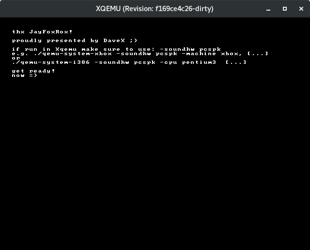

**beep**

This is a small POC, that one can use the beeper/PC speaker which is present in [Xqemu](https://github.com/xqemu/xqemu). (and possibly could be easily added to a real xbox, too)

Note:
you need to run xQemu (untested with Xqemu2) with the following extra arg:
"``-soundhw pcspk``"   
e.g.  `./qemu-system-xbox -soundhw pcspk -machine xbox, [...]`   (Xqemu1)  
or    `./qemu-system-i386 -soundhw pcspk -cpu pentium3  [...]`   (Xqemu2)  

the beeping code has been stole from "Matrix" (https://board.flatassembler.net/topic.php?t=1813) (15 Sep 2004, 20:17)

<a href="bin/default.xbe" download>-> default.xbe</a>  
<a href="beep.iso" download>-> beep.iso (xiso)</a>  

Have fun :D

